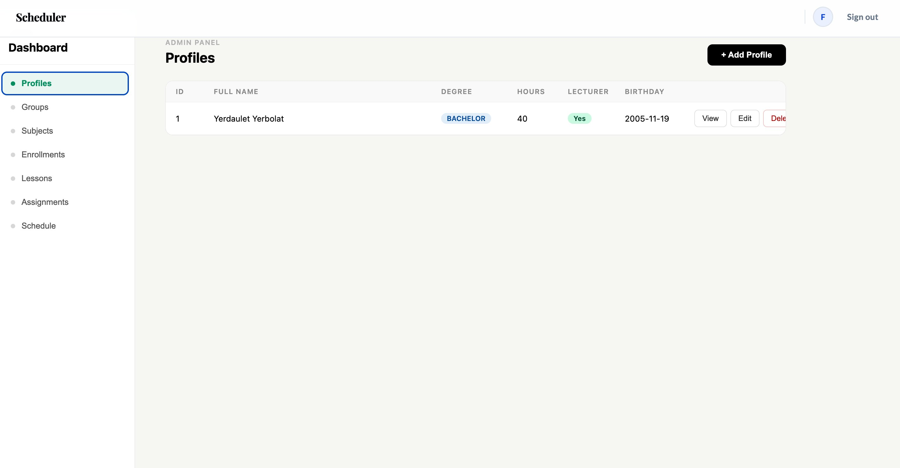
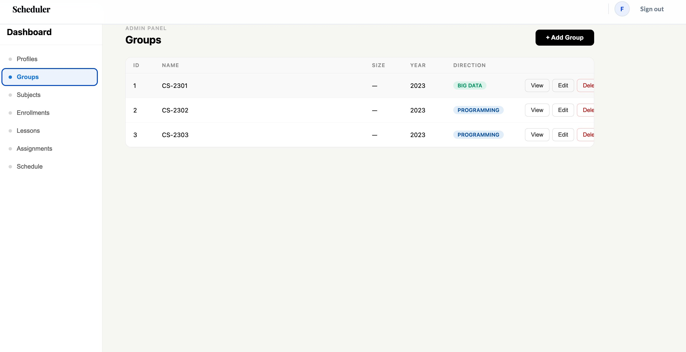
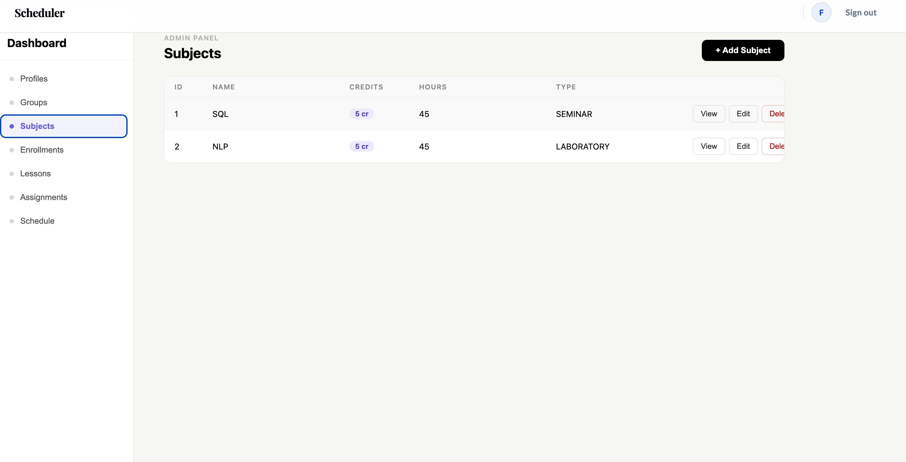
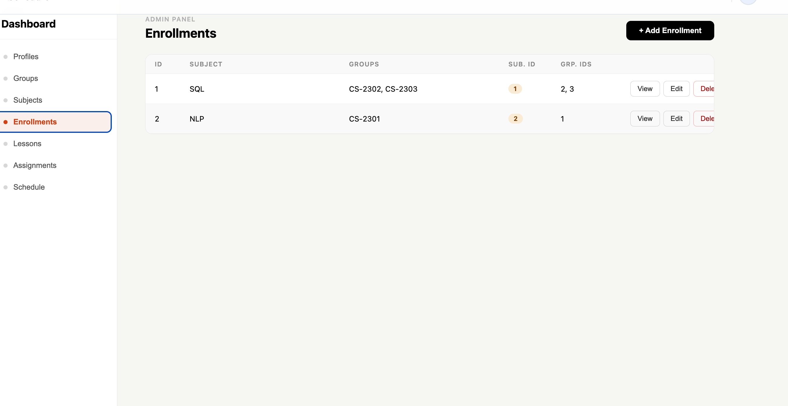
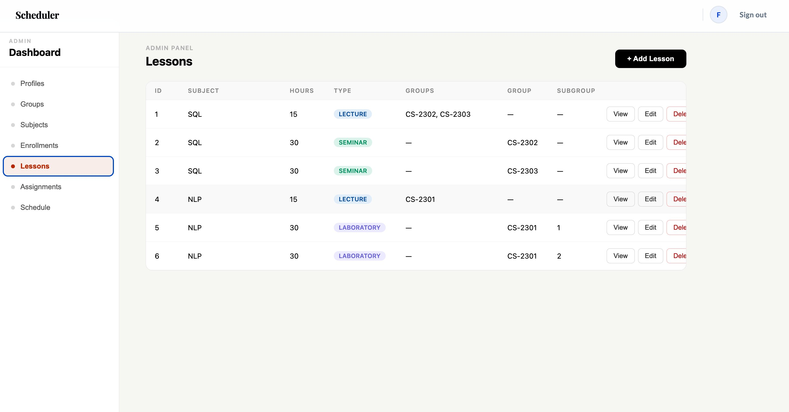
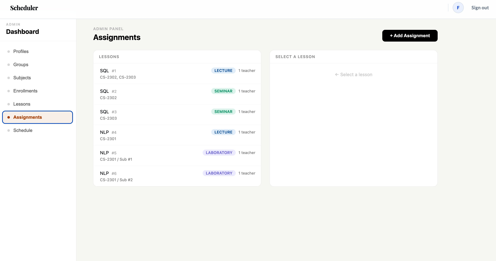
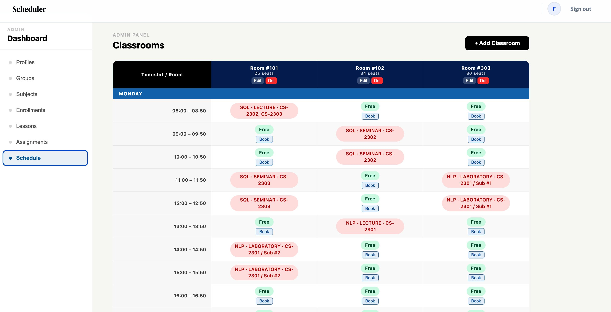

# SimpleScheduler

Academic class scheduling web application.


---

## Overview

SimpleScheduler is a full-stack web application for managing academic timetables. It covers the full scheduling lifecycle — from creating subjects and groups to booking classrooms and posting assignments — exposed through a REST API and consumed by a React frontend.

The backend is written in Java with Spring Boot and follows Clean Architecture principles: the domain layer has no dependency on frameworks or infrastructure, services contain business logic, and controllers handle only HTTP concerns.

---

## Features

- JWT authentication with email verification
- CRUD for profiles, subjects, groups, and lessons
- Classroom booking with visual timetable grid
- Student enrollment into groups
- Assignment management (active / non-active)
- Dockerized — runs with a single command

---

## Screenshots

**Profiles**


**Groups**


**Subjects**


**Enrollments**


**Lessons**


**Assignments**


**Schedule / Classroom Grid**


---

## Tech Stack

| Layer            | Technology              |
|------------------|-------------------------|
| Frontend         | React                   |
| Backend          | Java, Spring Boot       |
| Auth             | JWT                     |
| ORM              | JPA / Hibernate         |
| Database         | PostgreSQL              |
| Containerization | Docker, Docker Compose  |

---

## Installation

**Requirements:** Docker and Docker Compose

```bash
git clone https://github.com/your-username/simple-scheduler.git
cd simple-scheduler
cp .env.example .env
```

Edit `.env`:

```env
DB_NAME=simple_scheduler
DB_USER=postgres
DB_PASSWORD=secret
JWT_SECRET=your_secret_key
REACT_APP_API_URL=http://localhost:8080
```

```bash
docker-compose up --build
```

| Service  | URL                   |
|----------|-----------------------|
| Frontend | http://localhost:3000 |
| Backend  | http://localhost:8080 |

---

## API Endpoints

Base URL: `http://localhost:8080`

All endpoints except `/register` and `/login` require:
```
Authorization: Bearer <token>
```

### Auth
| Method | Endpoint                 | Description        |
|--------|--------------------------|--------------------|
| POST   | `/register`              | Register           |
| GET    | `/register/verify`       | Verify email       |
| POST   | `/login`                 | Login, returns JWT |
| GET    | `/login/{user_id}/check` | Check session      |

### Profiles
| Method | Endpoint          | Description |
|--------|-------------------|-------------|
| GET    | `/profiles`       | List all    |
| GET    | `/profiles/{id}`  | Get by ID   |
| POST   | `/profiles`       | Create      |
| PUT    | `/profiles/{id}`  | Update      |
| DELETE | `/profiles/{id}`  | Delete      |

### Subjects
| Method | Endpoint          | Description |
|--------|-------------------|-------------|
| GET    | `/subjects`       | List all    |
| GET    | `/subjects/{id}`  | Get by ID   |
| POST   | `/subjects`       | Create      |
| PUT    | `/subjects/{id}`  | Update      |
| DELETE | `/subjects/{id}`  | Delete      |

### Lessons
| Method | Endpoint    | Description |
|--------|-------------|-------------|
| GET    | `/lessons`  | List all    |
| POST   | `/lessons`  | Create      |

### Groups
| Method | Endpoint        | Description |
|--------|-----------------|-------------|
| GET    | `/groups`       | List all    |
| GET    | `/groups/{id}`  | Get by ID   |
| POST   | `/groups`       | Create      |
| PUT    | `/groups/{id}`  | Update      |
| DELETE | `/groups/{id}`  | Delete      |

### Enrollments
| Method | Endpoint              | Description |
|--------|-----------------------|-------------|
| GET    | `/enrollments`        | List all    |
| GET    | `/enrollments/{id}`   | Get by ID   |
| POST   | `/enrollments`        | Enroll      |

### Classrooms
| Method | Endpoint               | Description |
|--------|------------------------|-------------|
| GET    | `/classrooms`          | List all    |
| POST   | `/classrooms`          | Create      |
| POST   | `/classrooms/book`     | Book a room |
| PUT    | `/classrooms/{id}`     | Update      |
| DELETE | `/classrooms/{id}`     | Delete      |

### Assignments
| Method | Endpoint                  | Description     |
|--------|---------------------------|-----------------|
| GET    | `/assignments`            | List active     |
| GET    | `/assignments/nonactive`  | List non-active |
| POST   | `/assignments`            | Create          |

---

## Project Structure

```
simple-scheduler/
├── backend/
│   └── src/main/java/
│       ├── controller/       # HTTP layer
│       ├── service/          # Business logic
│       ├── domain/           # Entities, repository interfaces
│       ├── infrastructure/   # JPA implementations
│       └── config/           # Security, JWT
├── frontend/
│   └── src/
│       ├── pages/            # Route components
│       ├── components/       # Reusable UI
│       └── api/              # API client
├── docker-compose.yml
└── .env.example
```

---

## Architecture

The backend follows Clean Architecture. Dependencies flow inward — infrastructure depends on domain, never the other way around.

```
Controller → Service → Domain
                          ↑
               Repository Interface
                          ↑
               Infrastructure (JPA)
```

This keeps business logic independent of frameworks, making it straightforward to test and extend.


